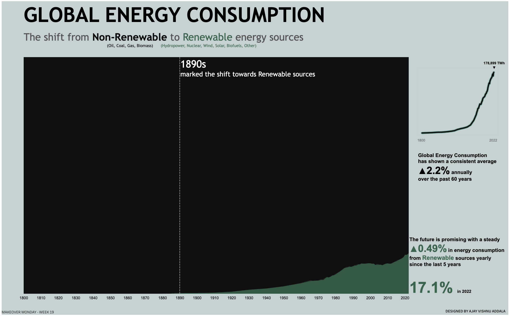

# Global Energy Consumption Trends - Makeover Monday Challenge

## Overview
This repository contains the data and visualization created for the Makeover Monday challenge, showcasing global energy consumption trends over time. The visualization was created using Tableau and highlights the shift towards renewable energy sources.

## Dataset
The dataset used for this visualization includes historical data on global energy consumption from various sources, spanning from the year 1800 to 2022. It includes data on renewable sources such as biofuels, solar, wind, nuclear, and hydropower, as well as non-renewable sources like gas, oil, and coal.

## Visualization
The visualization presents an area chart illustrating the trend in global energy consumption over time, with a focus on the increasing utilization of renewable energy sources. The chart clearly demonstrates the steady growth in renewable energy consumption, reaching 17.1% of the total energy consumption in 2022.

### Snapshot

### Tableau Public URL
[View the visualization on Tableau Public](https://public.tableau.com/app/profile/ajay.vishnu.addala/viz/GlobalEnergyConsumptionTheshifttoRenewablesourcesMOM2024Week19/GlobalEneryConsumption)

## Repository Contents
- Directory containing the dataset used for the visualization.
- Snapshot of the Tableau visualization.
- Video demonstration of the Tableau visualization.
- Tableau packaged workbook file containing the visualization.

## How to Use
1. Download or clone the repository to your local machine.
2. Open the Tableau file using Tableau Desktop or Tableau Public.
3. Explore the visualization to understand global energy consumption trends.

